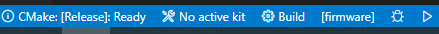

# 3D stage controller firmare build instructions

## System package dependencies (build system, compiler, etc)
Install the following packages for Debian based distros:
```
sudo apt-get install cmake
sudo apt-get install git
sudo apt-get install gcc-avr
sudo apt-get install gdb-avr
sudo apt-get install avr-libc
sudo apt-get install binutils-avr
sudo apt-get install uisp
sudo apt-get install avrdude
```
or the following ones for Fedora:
```
sudo dnf install avr-gcc
sudo dnf install avr-libc
sudo dnf install avr-binutils
sudo dnf install uisp
sudo dnf install avrdude
```
Note that on Ubuntu it was required to remove the brltty package to get the serial port setup:
```
sudo apt remove brltty
```
## Using avr-gcc directly and programming (here just for information)
Compile the code (generate a HEX file):
```
avr-gcc -w -Os -DF_CPU=16000000UL -mmcu=atmega328 -c -o main.o main.c
avr-gcc -w -mmcu=atmega328 main.o -o main
avr-objcopy -O ihex -R .eeprom main main.hex
```
Program the HEX firmware onto the AVR:
```
sudo avrdude -F -V -c avrispmkII -p ATmega328 -P usb -U flash:w:main.hex
```

## Firmare build steps
```
mkdir build-Release
cd build-Release
cmake -G "Unix Makefiles" -DCMAKE_BUILD_TYPE=Release -DCMAKE_TOOLCHAIN_FILE=../cmake/AVRToolchain.cmake ../
cmake --build . --config Release --target firmware
```

On VSCode, just open the editor on the root repository folder, and configure cmake as shown:

